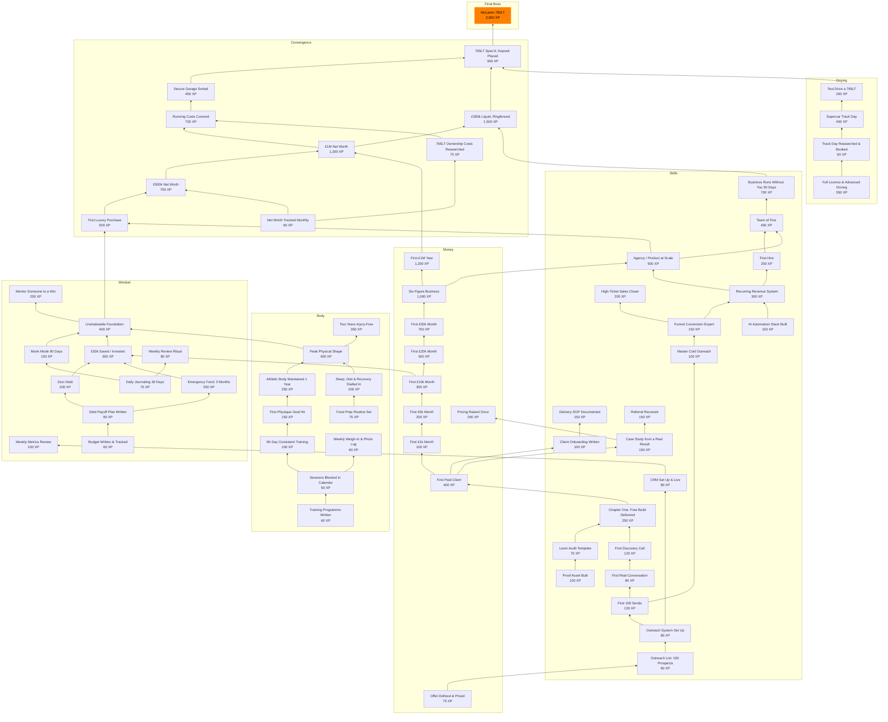

# 765LT Life Skill Tree — Complete Reference

*Generated 2026-08-11 by `scripts/make_docs.py` from the node data in `index.html`. Do not hand-edit — regenerate it.*

**67 nodes · 21,875 XP · 22 steps along the longest path to the car · 9 nodes open from a standing start.**

## How the tree works

Three states, and one rule that produces all of them.

| State | Meaning |
|---|---|
| **Locked** | At least one prerequisite is incomplete. Cannot be clicked. |
| **Available** | Every prerequisite is complete. Click to complete it. |
| **Complete** | Done. Click again to undo. |

A node is available the moment **all** of its prerequisites are complete — prerequisites are ANDed, never ORed. There are no partial unlocks.

**Un-completing cascades.** Clearing a node also clears everything standing on top of it, recursively. Without that the board could show a state its own rules forbid — the car owned with its run-up untouched.

**Saved progress is pruned on load.** Anything completed whose prerequisites no longer hold is cleared, repeatedly, until the state is consistent. This is what keeps old saves honest when the tree itself changes.

**XP is weight, not currency.** Nothing is bought with it. It exists so the progress bar reflects difficulty rather than node count — the car alone is 2,000 XP, 9% of the board.

## The tracks

| Track | Nodes | XP | Opens with | Ends at |
|---|---|---|---|---|
| 💰 **Money** | 10 | 4,775 | Offer Defined & Priced | First £1M Year |
| 🧠 **Skills** | 22 | 4,315 | AI Automation Stack Built, Proof Asset Built | Business Runs Without You 90 Days |
| 💪 **Body** | 10 | 1,695 | Training Programme Written, Food Prep Routine Set | Two Years Injury-Free |
| 🧘 **Mindset** | 11 | 1,945 | Daily Journaling 30 Days, Budget Written & Tracked | Mentor Someone to a Win |
| 🏁 **Driving** | 4 | 1,010 | Full Licence & Advanced Driving | Test Drive a 765LT |
| 🏆 **Convergence** | 9 | 6,135 | Net Worth Tracked Monthly | 765LT Spec'd, Deposit Placed |
| 🏎️ **Final Boss** | 1 | 2,000 | McLaren 765LT | McLaren 765LT |

- 💰 **Money** — Revenue, collected and repeatable.
- 🧠 **Skills** — The capabilities that produce the revenue.
- 💪 **Body** — The machine you run everything else on.
- 🧘 **Mindset** — Behaviour under load, and the financial floor.
- 🏁 **Driving** — Being able to drive it before you can afford it.
- 🏆 **Convergence** — Where the tracks meet and the run-up begins.
- 🏎️ **Final Boss** — The machine.

## The critical path

The longest unavoidable chain — 22 steps. Every node here blocks the one after it, so this is the shortest the tree can possibly be, no matter what order you work in.

1. **Offer Defined & Priced** — 75 XP 💰
2. **Outreach List: 100 Prospects** — 60 XP 🧠
3. **Outreach System Set Up** — 80 XP 🧠
4. **First 100 Sends** — 120 XP 🧠
5. **First Real Conversation** — 80 XP 🧠
6. **First Discovery Call** — 120 XP 🧠
7. **Chapter One: Free Build Delivered** — 250 XP 🧠
8. **First Paid Client** — 400 XP 💰
9. **First £1k Month** — 100 XP 💰
10. **First £5k Month** — 200 XP 💰
11. **First £10k Month** — 350 XP 💰
12. **First £20k Month** — 500 XP 💰
13. **First £50k Month** — 750 XP 💰
14. **Six-Figure Business** — 1,000 XP 💰
15. **Agency / Product at Scale** — 500 XP 🧠
16. **First Luxury Purchase** — 500 XP 🏆
17. **£500k Net Worth** — 750 XP 🏆
18. **£1M Net Worth** — 1,200 XP 🏆
19. **Running Costs Covered** — 700 XP 🏆
20. **Secure Garage Sorted** — 450 XP 🏆
21. **765LT Spec'd, Deposit Placed** — 900 XP 🏆
22. **McLaren 765LT** — 2,000 XP 🏎️

The other 45 nodes sit alongside it. 54 of the 66 non-car nodes are required for the car, transitively — the tree has very little decoration.

## Map

Bottom-to-top: arrows point from a prerequisite to what it unlocks.

## The nodes

### 💰 Money

*Revenue, collected and repeatable.*

#### 39. Offer Defined & Priced

`75 XP` · earliest step 1 · Money track · **blocks 40 nodes**

> One page: who it is for, what they get, what it costs.

One page that answers three questions without hedging: who it is for, what they get, and what it costs. Everything downstream — the list, the message, the call — is unanswerable until this exists.

**Done when:** One page written, with a specific buyer, a specific deliverable and a number.

**Watch out:** Writing 'anyone who needs growth'. If the buyer is everyone, the message is for nobody.

**Requires:** nothing — open from the start.

**Unlocks:** [Outreach List: 100 Prospects](#41-outreach-list-100-prospects)

#### 48. First Paid Client

`400 XP` · earliest step 8 · Money track · **blocks 26 nodes**

> Someone paid you. The whole bottom of this tree exists for this.

Someone paid you. Not a promise, not a trial — money received for work you own. Every node beneath this exists to produce it.

**Done when:** Cleared payment from a client who is not a friend.

**Watch out:** Discounting to get there. A £200 client at 80% off teaches the wrong lesson.

**Requires:** [Chapter One: Free Build Delivered](#47-chapter-one-free-build-delivered)

**Unlocks:** [First £1k Month](#1-first-1k-month) · [Client Onboarding Written](#49-client-onboarding-written) · [Case Study from a Real Result](#52-case-study-from-a-real-result)

#### 1. First £1k Month

`100 XP` · earliest step 9 · Money track · **blocks 20 nodes**

> The first proof that money can come from something you built.

One calendar month in which £1,000 lands in your account from work you own — not wages, not a gift, not a loan. The number is small on purpose: its only job is to prove the mechanism exists at all. Everything above this node is that same mechanism run harder.

**Done when:** £1,000 cleared and collected inside a single calendar month.

**Watch out:** Counting invoiced-but-unpaid. Money you have not received is a hope, not a month.

**Requires:** [First Paid Client](#48-first-paid-client)

**Unlocks:** [First £5k Month](#2-first-5k-month)

#### 2. First £5k Month

`200 XP` · earliest step 10 · Money track · **blocks 19 nodes**

> Past pocket money — this one covers a life.

The month that stops being pocket money and starts covering a life. Getting here usually means one of two things changed: you raised prices, or you stopped taking work that pays badly. Both are decisions, not effort.

**Done when:** £5,000 collected inside a calendar month.

**Watch out:** Hitting it once by working a 90-hour month. If it cost you the next month, it did not count for much.

**Requires:** [First £1k Month](#1-first-1k-month)

**Unlocks:** [First £10k Month](#3-first-10k-month)

#### 53. Pricing Raised Once

`200 XP` · earliest step 10 · Money track · terminal node

> You charged more and they still said yes.

You charged more than last time and they still said yes. The fastest revenue increase available, and the one most people never test.

**Done when:** One client won at a higher price than your previous rate.

**Watch out:** Raising it only for new leads while carrying old prices forever.

**Requires:** [Case Study from a Real Result](#52-case-study-from-a-real-result)

**Unlocks:** nothing — this is the end of its line.

#### 3. First £10k Month

`350 XP` · earliest step 11 · Money track · **blocks 18 nodes**

> The number most people never reach, cleared.

Five figures. This is the level where most people who try this stop, and where the work shifts from finding any client to running a pipeline. It is also the last level you can reach purely by doing everything yourself.

**Done when:** £10,000 collected inside a calendar month.

**Watch out:** One client being 80% of it. That is not a business, it is a job with extra steps.

**Requires:** [First £5k Month](#2-first-5k-month)

**Unlocks:** [First £20k Month](#4-first-20k-month) · [£50k Saved / Invested](#21-50k-saved-invested)

#### 4. First £20k Month

`500 XP` · earliest step 12 · Money track · **blocks 14 nodes**

> Repeatable enough that it stops feeling like luck.

Twenty thousand in a month, and — the part that matters — a repeat of it. At this point the question stops being 'can I' and becomes 'what breaks if I do this again next month'.

**Done when:** £20,000 collected in a month, and the pipeline to see the next one coming.

**Watch out:** Treating a spike as a level. A single good month is a data point, not a floor.

**Requires:** [First £10k Month](#3-first-10k-month)

**Unlocks:** [First £50k Month](#5-first-50k-month)

#### 5. First £50k Month

`750 XP` · earliest step 13 · Money track · **blocks 13 nodes**

> A real business now, not a freelancer having a good month.

Fifty thousand a month is where a business stops being a freelancer with good months. Delivery at this level cannot be only you, which is why the Skills track starts mattering more than the Money track here.

**Done when:** £50,000 collected in a month, with delivery that survived it.

**Watch out:** Selling more than you can deliver. Revenue you have to refund was never revenue.

**Requires:** [First £20k Month](#4-first-20k-month)

**Unlocks:** [Six-Figure Business](#6-six-figure-business)

#### 6. Six-Figure Business

`1,000 XP` · earliest step 14 · Money track · **blocks 12 nodes**

> Consistent £100k+ revenue per month.

Consistent £100k+ per month. Not a record month — a normal one. This is the node the whole Money track exists to reach, and the one the endgame is built on top of.

**Done when:** Three consecutive months at £100,000 or more.

**Watch out:** Averaging your way there. Three months of £60k, £90k and £150k is not this node.

**Requires:** [First £50k Month](#5-first-50k-month)

**Unlocks:** [Agency / Product at Scale](#12-agency-product-at-scale) · [First £1M Year](#26-first-1m-year)

#### 26. First £1M Year

`1,200 XP` · earliest step 15 · Money track · **blocks 6 nodes**

> Twelve months, seven figures collected.

A full trading year at seven figures. Twelve months smooths out everything a good quarter can hide — seasonality, one-off deals, a single client's budget cycle.

**Done when:** £1,000,000 collected across twelve consecutive months.

**Watch out:** Confusing contracted value with collected cash. Only what cleared counts.

**Requires:** [Six-Figure Business](#6-six-figure-business)

**Unlocks:** [£1M Net Worth](#34-1m-net-worth)

### 🧠 Skills

*The capabilities that produce the revenue.*

#### 10. AI Automation Stack Built

`150 XP` · earliest step 1 · Skills track · **blocks 13 nodes**

> The systems handle the busywork so you can run the business.

A working automation stack running on live data — CRM connected, leads routed, follow-ups firing, and failures visible when they happen. The test is not that you built it, but that it kept running while you were not watching.

**Done when:** Automations running unattended on real data for 30 consecutive days.

**Watch out:** Building the stack as a substitute for outreach. This node is infrastructure, and infrastructure is the most comfortable place to hide.

**Requires:** nothing — open from the start.

**Unlocks:** [Recurring Revenue System](#11-recurring-revenue-system)

#### 40. Proof Asset Built

`100 XP` · earliest step 1 · Skills track · **blocks 29 nodes**

> One thing you can send that proves you can do the work.

One artefact you can send that proves you can do the work — a teardown, a sample build, a before-and-after. Without it every message is a claim.

**Done when:** One asset finished and sendable, not a plan for one.

**Watch out:** Polishing it indefinitely. It has to be good enough to send, not perfect.

**Requires:** nothing — open from the start.

**Unlocks:** [Loom Audit Template](#43-loom-audit-template)

#### 41. Outreach List: 100 Prospects

`60 XP` · earliest step 2 · Skills track · **blocks 39 nodes**

> A hundred named people, not a vague niche.

A hundred named businesses with a person attached, not a niche description. This is dull, mechanical and the single highest-leverage hour in the tree.

**Done when:** 100 rows: business, person, contact, and one specific observation each.

**Watch out:** Scraping 1,000 unqualified names. A hundred you have actually looked at beats a thousand you have not.

**Requires:** [Offer Defined & Priced](#39-offer-defined-priced)

**Unlocks:** [Outreach System Set Up](#42-outreach-system-set-up)

#### 43. Loom Audit Template

`75 XP` · earliest step 2 · Skills track · **blocks 28 nodes**

> A repeatable audit video you can record in twenty minutes.

A repeatable audit video: same structure every time, twenty minutes, sent with the fix already visible. This is the build-first pitch, made repeatable.

**Done when:** One template recorded end to end, timed, and reusable.

**Watch out:** Bespoke every time. If it takes two hours you will stop doing it.

**Requires:** [Proof Asset Built](#40-proof-asset-built)

**Unlocks:** [Chapter One: Free Build Delivered](#47-chapter-one-free-build-delivered)

#### 42. Outreach System Set Up

`80 XP` · earliest step 3 · Skills track · **blocks 38 nodes**

> Tracker, templates and follow-ups, ready to run daily.

The machinery around the sending: a tracker with statuses, message templates, and a follow-up sequence with dates. You already build this kind of thing well — the risk is building it instead of sending.

**Done when:** Tracker live, templates written, follow-up cadence defined.

**Watch out:** This is the most comfortable node in the tree. Timebox it to a day.

**Requires:** [Outreach List: 100 Prospects](#41-outreach-list-100-prospects)

**Unlocks:** [First 100 Sends](#44-first-100-sends) · [CRM Set Up & Live](#51-crm-set-up-live)

#### 44. First 100 Sends

`120 XP` · earliest step 4 · Skills track · **blocks 35 nodes**

> A hundred real sends, logged, with the reply rate known.

A hundred real sends, logged, with the reply rate known afterwards. Not a campaign — the first honest measurement of your own numbers.

**Done when:** 100 contacted, logged, with a reply rate you can state.

**Watch out:** Stopping at 40 because none replied. The number is the point.

**Requires:** [Outreach System Set Up](#42-outreach-system-set-up)

**Unlocks:** [Master Cold Outreach](#7-master-cold-outreach) · [First Real Conversation](#45-first-real-conversation)

#### 51. CRM Set Up & Live

`80 XP` · earliest step 4 · Skills track · **blocks 1 nodes**

> A pipeline that lives somewhere other than your head.

A pipeline that lives somewhere other than your memory, with stages and next actions. You already have a tracker; this is making it the real system.

**Done when:** Every live prospect in one system, with a stage and a next action.

**Watch out:** Two systems. One imperfect source of truth beats two tidy ones.

**Requires:** [Outreach System Set Up](#42-outreach-system-set-up)

**Unlocks:** [Weekly Metrics Review](#55-weekly-metrics-review)

#### 7. Master Cold Outreach

`100 XP` · earliest step 5 · Skills track · **blocks 15 nodes**

> Strangers reply, book, and actually show up.

A repeatable outbound motion: a list you can rebuild, a message that gets replies, and a follow-up sequence you actually run. The skill is not writing one good email — it is knowing your numbers well enough to predict next month from this month's sends.

**Done when:** 100 contacts sent, with a reply and booking rate you can state from memory.

**Watch out:** Volume without measurement. If you cannot name your reply rate, you have not learned the skill, you have just done the activity.

**Requires:** [First 100 Sends](#44-first-100-sends)

**Unlocks:** [Funnel Conversion Expert](#8-funnel-conversion-expert)

#### 45. First Real Conversation

`80 XP` · earliest step 5 · Skills track · **blocks 29 nodes**

> Someone replied and it became an actual conversation.

Someone replied and it became a real back-and-forth. The first evidence that the message lands on a human rather than a list.

**Done when:** One genuine two-way conversation with a prospect.

**Watch out:** Counting an auto-reply or a no. A no is data, not a conversation.

**Requires:** [First 100 Sends](#44-first-100-sends)

**Unlocks:** [First Discovery Call](#46-first-discovery-call)

#### 8. Funnel Conversion Expert

`150 XP` · earliest step 6 · Skills track · **blocks 14 nodes**

> You can find the leak and close it.

Being able to look at a funnel, find where it leaks, change one thing, and see the number move. This is the core AIGO skill and it is diagnostic, not creative — the value is in correctly identifying which stage is broken.

**Done when:** A measured before and after on a real funnel, with the change you made named.

**Watch out:** Redesigning the whole funnel. If you change five things you have learned nothing about any of them.

**Requires:** [Master Cold Outreach](#7-master-cold-outreach)

**Unlocks:** [High-Ticket Sales Closer](#9-high-ticket-sales-closer) · [Recurring Revenue System](#11-recurring-revenue-system)

#### 46. First Discovery Call

`120 XP` · earliest step 6 · Skills track · **blocks 28 nodes**

> A real call, in the calendar, with a real business.

A real call, in the calendar, with a real business. The point at which outreach stops being theoretical.

**Done when:** One discovery call held.

**Watch out:** Treating it as a pitch. The first one is for finding out what is broken.

**Requires:** [First Real Conversation](#45-first-real-conversation)

**Unlocks:** [Chapter One: Free Build Delivered](#47-chapter-one-free-build-delivered)

#### 9. High-Ticket Sales Closer

`200 XP` · earliest step 7 · Skills track · terminal node

> You close four figures on a live call without flinching.

Closing four figures on a live call, repeatedly, without discounting to get there. The skill is holding the price through the silence.

**Done when:** Three or more four-figure deals closed live, at the price you set.

**Watch out:** Closing once and calling it a skill. Three is the minimum sample that separates ability from a warm lead.

**Requires:** [Funnel Conversion Expert](#8-funnel-conversion-expert)

**Unlocks:** nothing — this is the end of its line.

#### 11. Recurring Revenue System

`300 XP` · earliest step 7 · Skills track · **blocks 12 nodes**

> Income that arrives whether or not you sold anything today.

Income that arrives without a new sale — retainers, subscriptions, or managed service. The distinction from a repeat client is that renewal is the default and cancellation is the action.

**Done when:** Three consecutive months of recurring income that renewed without being re-sold.

**Watch out:** Calling repeat project work recurring. If you have to win it again, it is not.

**Requires:** [Funnel Conversion Expert](#8-funnel-conversion-expert) · [AI Automation Stack Built](#10-ai-automation-stack-built)

**Unlocks:** [Agency / Product at Scale](#12-agency-product-at-scale) · [First Hire](#27-first-hire)

#### 47. Chapter One: Free Build Delivered

`250 XP` · earliest step 7 · Skills track · **blocks 27 nodes**

> Pick one coach, audit for real, build the fix, pitch with it done.

The action already agreed and not yet done: pick one specific coach, audit their funnel for real, build the actual fix, and pitch with the work in hand. It is the hinge of the whole tree — everything above it waits on this.

**Done when:** One named coach, a real audit, a delivered build, and a pitch actually sent.

**Watch out:** Choosing a safer prospect, or building something generic. One real one beats five hypotheticals.

**Requires:** [Loom Audit Template](#43-loom-audit-template) · [First Discovery Call](#46-first-discovery-call)

**Unlocks:** [First Paid Client](#48-first-paid-client)

#### 27. First Hire

`250 XP` · earliest step 8 · Skills track · **blocks 5 nodes**

> Someone else's hands on the work for the first time.

The first time someone else's hands are on the work. Usually the hardest single step in the Skills track, because it converts an implicit process in your head into something that has to be written down.

**Done when:** One person paid, owning a recurring outcome, for 60 days.

**Watch out:** Hiring help instead of hiring ownership. If you still hold the outcome, you have bought hours, not capacity.

**Requires:** [Recurring Revenue System](#11-recurring-revenue-system)

**Unlocks:** [Team of Five](#28-team-of-five)

#### 49. Client Onboarding Written

`100 XP` · earliest step 9 · Skills track · **blocks 1 nodes**

> What happens in the first week, written before you need it.

What happens in the first week, written before you need it: what you ask for, what you send, what they see and when.

**Done when:** An onboarding sequence written down and used once.

**Watch out:** Improvising it every time and calling that flexibility.

**Requires:** [First Paid Client](#48-first-paid-client)

**Unlocks:** [Delivery SOP Documented](#50-delivery-sop-documented)

#### 52. Case Study from a Real Result

`150 XP` · earliest step 9 · Skills track · **blocks 2 nodes**

> A real result, written up, with the numbers in it.

A real result written up with the numbers in it — what was broken, what you did, what changed. It is the asset that makes the next sale easier.

**Done when:** One case study from actual client work, with real figures.

**Watch out:** Writing it from a mock. This node specifically requires a paying client.

**Requires:** [First Paid Client](#48-first-paid-client)

**Unlocks:** [Pricing Raised Once](#53-pricing-raised-once) · [Referral Received](#54-referral-received)

#### 50. Delivery SOP Documented

`150 XP` · earliest step 10 · Skills track · terminal node

> The delivery process written so someone else could run it.

The delivery process written so somebody else could run it. This is the node that makes hiring possible later — you cannot delegate what only exists in your head.

**Done when:** A written process another person could follow without asking you.

**Watch out:** Documenting what you wish you did rather than what you actually do.

**Requires:** [Client Onboarding Written](#49-client-onboarding-written)

**Unlocks:** nothing — this is the end of its line.

#### 54. Referral Received

`150 XP` · earliest step 10 · Skills track · terminal node

> A client sent you someone else.

A client sent you someone else, unprompted. The first sign delivery is good enough to be recommended.

**Done when:** One referral received from a paying client.

**Watch out:** Asking so hard it becomes a favour. A real referral is voluntary.

**Requires:** [Case Study from a Real Result](#52-case-study-from-a-real-result)

**Unlocks:** nothing — this is the end of its line.

#### 12. Agency / Product at Scale

`500 XP` · earliest step 15 · Skills track · **blocks 10 nodes**

> It grows without your hands on every single part of it.

The business grows in a month where you personally do less. That is the whole definition. It requires the recurring revenue underneath it and the six-figure months beside it, which is why it sits where it does.

**Done when:** A month where revenue rose and your own delivery hours fell.

**Watch out:** Scaling the work instead of the system. More clients handled the same way is volume, not scale.

**Requires:** [Recurring Revenue System](#11-recurring-revenue-system) · [Six-Figure Business](#6-six-figure-business)

**Unlocks:** [First Luxury Purchase](#23-first-luxury-purchase) · [Team of Five](#28-team-of-five)

#### 28. Team of Five

`450 XP` · earliest step 16 · Skills track · **blocks 4 nodes**

> Enough people that the bottleneck stops being you.

Five people with defined roles and outcomes they own. At five you can no longer run everything through yourself informally, which forces the operating structure the next node depends on.

**Done when:** Five people in defined roles, each owning a named outcome.

**Watch out:** Five people all reporting into you for every decision. That is a bottleneck with a bigger payroll.

**Requires:** [First Hire](#27-first-hire) · [Agency / Product at Scale](#12-agency-product-at-scale)

**Unlocks:** [Business Runs Without You 90 Days](#29-business-runs-without-you-90-days)

#### 29. Business Runs Without You 90 Days

`700 XP` · earliest step 17 · Skills track · **blocks 3 nodes**

> Ninety days away and the numbers held.

Ninety days at arm's length with the numbers holding. This is the node that makes the endgame possible: a business that needs you daily cannot fund a car, because you cannot stop earning long enough to enjoy it.

**Done when:** 90 days at arm's length with revenue flat or up.

**Watch out:** Being reachable the whole time. If you answered every day, you tested nothing.

**Requires:** [Team of Five](#28-team-of-five)

**Unlocks:** [£300k Liquid, Ringfenced](#37-300k-liquid-ringfenced)

### 💪 Body

*The machine you run everything else on.*

#### 56. Training Programme Written

`60 XP` · earliest step 1 · Body track · **blocks 17 nodes**

> The programme written down before the first session.

The programme written before the first session — sets, reps, progression, which days. Deciding in the gym is how blocks fall apart.

**Done when:** A written programme covering a full training block.

**Watch out:** Rewriting it every fortnight. The programme works because you stop changing it.

**Requires:** nothing — open from the start.

**Unlocks:** [Sessions Blocked in Calendar](#57-sessions-blocked-in-calendar)

#### 58. Food Prep Routine Set

`75 XP` · earliest step 1 · Body track · **blocks 13 nodes**

> Food handled in advance so the diet is not a daily decision.

Food handled in advance so eating well is not a decision you make while hungry. Diet is your named weak point; this is the node that addresses it structurally rather than by willpower.

**Done when:** A prep routine running for four consecutive weeks.

**Watch out:** A perfect plan you abandon in week two. Make it boring and repeatable.

**Requires:** nothing — open from the start.

**Unlocks:** [Sleep, Diet & Recovery Dialled In](#16-sleep-diet-recovery-dialled-in)

#### 16. Sleep, Diet & Recovery Dialled In

`200 XP` · earliest step 2 · Body track · **blocks 12 nodes**

> The unglamorous half that decides everything else.

The unglamorous half: sleep, protein, and actual recovery. It is a root node with no prerequisites because it gates the ceiling on everything else in this track, and you can start it tonight.

**Done when:** Eight weeks of consistent sleep hours, hit protein targets and planned deloads.

**Watch out:** Optimising supplements while sleeping six hours. The order matters.

**Requires:** [Food Prep Routine Set](#58-food-prep-routine-set)

**Unlocks:** [Peak Physical Shape](#17-peak-physical-shape)

#### 57. Sessions Blocked in Calendar

`50 XP` · earliest step 2 · Body track · **blocks 16 nodes**

> The sessions exist in the calendar as appointments.

The sessions exist in the calendar as appointments, not intentions. It takes ten minutes and it is the difference between a plan and a wish.

**Done when:** A full training block blocked out in the calendar.

**Watch out:** Booking them and then treating them as the first thing to cancel.

**Requires:** [Training Programme Written](#56-training-programme-written)

**Unlocks:** [90-Day Consistent Training](#13-90-day-consistent-training) · [Weekly Weigh-In & Photo Log](#59-weekly-weigh-in-photo-log)

#### 13. 90-Day Consistent Training

`100 XP` · earliest step 3 · Body track · **blocks 14 nodes**

> Ninety days without negotiating with yourself.

Ninety days of training without a restart. Not a programme, not a split — the attendance itself. Everything else in this track is downstream of showing up.

**Done when:** 90 days logged, three or more sessions a week, with no restart.

**Watch out:** Restarting the count after a missed week. Miss one, continue anyway — that is the skill being tested.

**Requires:** [Sessions Blocked in Calendar](#57-sessions-blocked-in-calendar)

**Unlocks:** [First Physique Goal Hit](#14-first-physique-goal-hit)

#### 59. Weekly Weigh-In & Photo Log

`60 XP` · earliest step 3 · Body track · terminal node

> Same day, same conditions, recorded.

Same day, same conditions, recorded. Without measurement the body track runs on how you feel, which is the least reliable signal available.

**Done when:** Eight consecutive weeks of weigh-ins and photos, logged.

**Watch out:** Weighing daily and reacting to noise. Weekly, same conditions.

**Requires:** [Sessions Blocked in Calendar](#57-sessions-blocked-in-calendar)

**Unlocks:** nothing — this is the end of its line.

#### 14. First Physique Goal Hit

`150 XP` · earliest step 4 · Body track · **blocks 13 nodes**

> The mirror finally agrees with the effort.

A physique target you set in advance and then hit. The number matters less than having named it beforehand, because a goal set afterwards is a description.

**Done when:** A number written down in advance — weight, body fat, or a lift — and reached.

**Watch out:** Moving the target once it is close. That converts a goal into a story.

**Requires:** [90-Day Consistent Training](#13-90-day-consistent-training)

**Unlocks:** [Athletic Body Maintained 1 Year](#15-athletic-body-maintained-1-year)

#### 15. Athletic Body Maintained 1 Year

`250 XP` · earliest step 5 · Body track · **blocks 12 nodes**

> Not a transformation photo — a default state.

Twelve months holding an athletic body. Not a peak, a baseline — the point at which it stops being a project and becomes the default state you return to.

**Done when:** Twelve months inside your target range, holidays and bad months included.

**Watch out:** Peaking for photos and drifting for the other ten months.

**Requires:** [First Physique Goal Hit](#14-first-physique-goal-hit)

**Unlocks:** [Peak Physical Shape](#17-peak-physical-shape)

#### 17. Peak Physical Shape

`400 XP` · earliest step 6 · Body track · **blocks 11 nodes**

> The body has stopped being the limiting factor.

Strength, composition and the absence of chronic niggles, all at once. Most people have two of the three at any time; this node is the intersection.

**Done when:** All three holding simultaneously for a full training block.

**Watch out:** Trading joints for numbers. A lift that costs you a shoulder is a withdrawal.

**Requires:** [Athletic Body Maintained 1 Year](#15-athletic-body-maintained-1-year) · [Sleep, Diet & Recovery Dialled In](#16-sleep-diet-recovery-dialled-in)

**Unlocks:** [Unshakeable Foundation](#22-unshakeable-foundation) · [Two Years Injury-Free](#31-two-years-injury-free)

#### 31. Two Years Injury-Free

`350 XP` · earliest step 7 · Body track · terminal node

> Long enough that it is who you are, not what you did.

Two years of training with no layoff longer than a fortnight. This is the node that distinguishes a body you built from a body you keep, and it can only be earned by time.

**Done when:** 24 months with no injury layoff longer than two weeks.

**Watch out:** Training through a real injury to protect the streak. That ends the streak later and worse.

**Requires:** [Peak Physical Shape](#17-peak-physical-shape)

**Unlocks:** nothing — this is the end of its line.

### 🧘 Mindset

*Behaviour under load, and the financial floor.*

#### 18. Daily Journaling 30 Days

`75 XP` · earliest step 1 · Mindset track · **blocks 12 nodes**

> Thirty days of telling yourself the truth in writing.

Thirty consecutive days of writing down what actually happened and what you actually thought. The value is not the writing, it is having a record that disagrees with your memory later.

**Done when:** 30 consecutive daily entries.

**Watch out:** Writing what you wish were true. A flattering journal is worse than none.

**Requires:** nothing — open from the start.

**Unlocks:** [Monk Mode 90 Days](#19-monk-mode-90-days) · [Weekly Review Ritual](#62-weekly-review-ritual)

#### 60. Budget Written & Tracked

`60 XP` · earliest step 1 · Mindset track · **blocks 14 nodes**

> Every pound in and out, tracked for a full month.

Every pound in and out, tracked for a full month. Not budgeting — measuring. You cannot plan a payoff or a buffer against numbers you are guessing at.

**Done when:** One full month tracked, income and outgoings, to the pound.

**Watch out:** Estimating. The gap between what you think you spend and what you spend is the entire point.

**Requires:** nothing — open from the start.

**Unlocks:** [Debt Payoff Plan Written](#61-debt-payoff-plan-written)

#### 19. Monk Mode 90 Days

`150 XP` · earliest step 2 · Mindset track · **blocks 10 nodes**

> Ninety days of removing everything that is not the mission.

Ninety days with a written list of things removed. The list is the point — monk mode without a definition is just a mood.

**Done when:** 90 days, against a written list of what was removed, with the list kept.

**Watch out:** Defining it so loosely that nothing was actually given up.

**Requires:** [Daily Journaling 30 Days](#18-daily-journaling-30-days)

**Unlocks:** [Unshakeable Foundation](#22-unshakeable-foundation)

#### 61. Debt Payoff Plan Written

`80 XP` · earliest step 2 · Mindset track · **blocks 13 nodes**

> Every debt listed, ordered, with a date it ends.

Every debt listed with its rate, ordered, and a date it ends. The plan itself, before any of it is paid.

**Done when:** Every debt listed with balance, rate and a target clear date.

**Watch out:** Leaving one off because it is embarrassing. The list has to be complete.

**Requires:** [Budget Written & Tracked](#60-budget-written-tracked)

**Unlocks:** [Zero Debt](#20-zero-debt) · [Emergency Fund: 3 Months](#63-emergency-fund-3-months)

#### 62. Weekly Review Ritual

`80 XP` · earliest step 2 · Mindset track · terminal node

> One hour every week reviewing the last one.

One hour every week reviewing the last one: what happened, what did not, what changes. This is the node that turns journaling from a record into a correction mechanism.

**Done when:** Eight consecutive weekly reviews.

**Watch out:** Writing a summary instead of making a decision.

**Requires:** [Daily Journaling 30 Days](#18-daily-journaling-30-days)

**Unlocks:** nothing — this is the end of its line.

#### 20. Zero Debt

`200 XP` · earliest step 3 · Mindset track · **blocks 11 nodes**

> Nobody holds a claim on your future income.

No consumer debt. Nobody holds a claim on income you have not earned yet. It has no prerequisites because it is available to start immediately and it gates the entire savings branch.

**Done when:** Zero consumer and credit debt outstanding.

**Watch out:** Rolling debt into a cheaper facility and calling it cleared.

**Requires:** [Debt Payoff Plan Written](#61-debt-payoff-plan-written)

**Unlocks:** [£50k Saved / Invested](#21-50k-saved-invested)

#### 63. Emergency Fund: 3 Months

`250 XP` · earliest step 3 · Mindset track · **blocks 11 nodes**

> Three months of costs, in cash, that you do not touch.

Three months of costs, in cash, that you do not touch. It is what lets you hold a price and refuse bad work, which is why it sits under the savings branch rather than beside it.

**Done when:** Three months of outgoings held in cash, untouched for 90 days.

**Watch out:** Investing it. This money's job is to be boring and available.

**Requires:** [Debt Payoff Plan Written](#61-debt-payoff-plan-written)

**Unlocks:** [£50k Saved / Invested](#21-50k-saved-invested)

#### 55. Weekly Metrics Review

`100 XP` · earliest step 5 · Mindset track · terminal node

> One hour a week looking at the numbers, every week.

One hour a week, same slot, looking at the actual numbers: sends, replies, calls, revenue. The habit that stops months disappearing.

**Done when:** Eight consecutive weekly reviews, written down.

**Watch out:** Reviewing only when things are going well.

**Requires:** [CRM Set Up & Live](#51-crm-set-up-live)

**Unlocks:** nothing — this is the end of its line.

#### 21. £50k Saved / Invested

`300 XP` · earliest step 12 · Mindset track · **blocks 10 nodes**

> A buffer big enough to make you dangerous instead of desperate.

Fifty thousand saved or invested, and left alone. Requires Zero Debt beneath it and the £10k months beside it, because saving while servicing debt is arithmetic working against you.

**Done when:** £50,000 across savings and investments, untouched for six months.

**Watch out:** Counting money already earmarked for tax. HMRC's money was never yours.

**Requires:** [Zero Debt](#20-zero-debt) · [First £10k Month](#3-first-10k-month) · [Emergency Fund: 3 Months](#63-emergency-fund-3-months)

**Unlocks:** [Unshakeable Foundation](#22-unshakeable-foundation)

#### 22. Unshakeable Foundation

`400 XP` · earliest step 13 · Mindset track · **blocks 9 nodes**

> Mind, money and body all holding at the same time.

Mind, money and body all holding at the same time — the only node in the tree that requires one branch from each of three tracks. Any one of them is achievable in isolation; the difficulty is simultaneity.

**Done when:** Monk mode, £50k invested and peak physical shape all standing together.

**Watch out:** Letting two slide to force the third. This node measures the floor, not the peak.

**Requires:** [Monk Mode 90 Days](#19-monk-mode-90-days) · [£50k Saved / Invested](#21-50k-saved-invested) · [Peak Physical Shape](#17-peak-physical-shape)

**Unlocks:** [First Luxury Purchase](#23-first-luxury-purchase) · [Mentor Someone to a Win](#30-mentor-someone-to-a-win)

#### 30. Mentor Someone to a Win

`250 XP` · earliest step 14 · Mindset track · terminal node

> Somebody else got there using what you worked out.

Someone else reached a defined outcome using what you worked out. It is the cleanest available test of whether you understand your own process or merely execute it.

**Done when:** One person hit a named outcome under your guidance.

**Watch out:** Giving advice and claiming the result. They have to actually get there.

**Requires:** [Unshakeable Foundation](#22-unshakeable-foundation)

**Unlocks:** nothing — this is the end of its line.

### 🏁 Driving

*Being able to drive it before you can afford it.*

#### 32. Full Licence & Advanced Driving

`350 XP` · earliest step 1 · Driving track · **blocks 5 nodes**

> Be able to drive it properly before you can afford it.

A full licence plus advanced driving — IAM, RoSPA or equivalent. It sits at the very bottom of the board with no prerequisites, which is deliberate: it is the one part of the endgame you could start this month, and it gates the deposit.

**Done when:** Full licence held, advanced driving qualification passed.

**Watch out:** Assuming the car teaches you. 765 horsepower is not where you learn.

**Requires:** nothing — open from the start.

**Unlocks:** [Track Day Researched & Booked](#64-track-day-researched-booked)

#### 64. Track Day Researched & Booked

`60 XP` · earliest step 2 · Driving track · **blocks 4 nodes**

> Date booked, deposit paid, car chosen.

Date booked, deposit paid, car chosen. A track day you have not booked is a daydream; this node converts it into a commitment with a date.

**Done when:** Booked and paid, with a date in the calendar.

**Watch out:** Waiting for a better time. There is not one.

**Requires:** [Full Licence & Advanced Driving](#32-full-licence-advanced-driving)

**Unlocks:** [Supercar Track Day](#33-supercar-track-day)

#### 33. Supercar Track Day

`400 XP` · earliest step 3 · Driving track · **blocks 3 nodes**

> Six hundred horsepower on a circuit, once, legally.

A track day in something with real power — 500bhp or more — on a circuit, legally. It tells you whether you want the car or the idea of the car, and it is far cheaper to find that out here.

**Done when:** One completed track day in a 500bhp+ car.

**Watch out:** A passenger ride. You need to be driving for this to answer anything.

**Requires:** [Track Day Researched & Booked](#64-track-day-researched-booked)

**Unlocks:** [Test Drive a 765LT](#67-test-drive-a-765lt)

#### 67. Test Drive a 765LT

`200 XP` · earliest step 4 · Driving track · **blocks 2 nodes**

> Sit in one. Drive one. Find out if you still want it.

Sit in one. Drive one. Find out whether you still want it after the noise and the seating position and the ride are real rather than imagined. Cheap compared to discovering it after purchase.

**Done when:** One test drive completed.

**Watch out:** Skipping it because you are certain. Certainty is exactly what it tests.

**Requires:** [Supercar Track Day](#33-supercar-track-day)

**Unlocks:** [765LT Spec'd, Deposit Placed](#38-765lt-specd-deposit-placed)

### 🏆 Convergence

*Where the tracks meet and the run-up begins.*

#### 65. Net Worth Tracked Monthly

`60 XP` · earliest step 1 · Convergence track · **blocks 8 nodes**

> One number, updated monthly, so the trend is visible.

One number, updated monthly, so the trend is visible rather than imagined. Everything in the run-up is measured against this.

**Done when:** Six consecutive monthly net worth entries.

**Watch out:** Only updating it when it went up.

**Requires:** nothing — open from the start.

**Unlocks:** [£500k Net Worth](#24-500k-net-worth) · [765LT Ownership Costs Researched](#66-765lt-ownership-costs-researched)

#### 66. 765LT Ownership Costs Researched

`75 XP` · earliest step 2 · Convergence track · **blocks 4 nodes**

> What it actually costs to own one, in writing.

What it actually costs to own one, written down: insurance at your age and postcode, servicing intervals, tyres, depreciation, storage. Most people research the price and not the ownership.

**Done when:** A written annual cost estimate with real quotes, not guesses.

**Watch out:** Using someone else's numbers. Insurance in particular is intensely personal.

**Requires:** [Net Worth Tracked Monthly](#65-net-worth-tracked-monthly)

**Unlocks:** [Running Costs Covered](#35-running-costs-covered)

#### 23. First Luxury Purchase

`500 XP` · earliest step 16 · Convergence track · **blocks 7 nodes**

> A watch or experience that proves the standard you're building for.

The first thing bought outright, from profit, purely because you wanted it. A watch, a trip, a piece of equipment. Its purpose is calibration — proving you can buy something significant without it destabilising anything.

**Done when:** Bought outright from profit, no finance, and no regret a month later.

**Watch out:** Financing it. The entire point is that it was paid for.

**Requires:** [Agency / Product at Scale](#12-agency-product-at-scale) · [Unshakeable Foundation](#22-unshakeable-foundation)

**Unlocks:** [£500k Net Worth](#24-500k-net-worth)

#### 24. £500k Net Worth

`750 XP` · earliest step 17 · Convergence track · **blocks 6 nodes**

> Half a million held — the last checkpoint before the machine.

Half a million in assets minus liabilities, documented rather than estimated. The first genuine wealth checkpoint and the last one before the run-up begins.

**Done when:** Assets minus liabilities at £500,000 or more, written down.

**Watch out:** Counting the business at a valuation nobody has offered.

**Requires:** [First Luxury Purchase](#23-first-luxury-purchase) · [Net Worth Tracked Monthly](#65-net-worth-tracked-monthly)

**Unlocks:** [£1M Net Worth](#34-1m-net-worth)

#### 34. £1M Net Worth

`1,200 XP` · earliest step 18 · Convergence track · **blocks 5 nodes**

> Seven figures held, not projected.

Seven figures held. Requires both the £500k checkpoint and a £1M trading year, because net worth built on a single good year is fragile.

**Done when:** Assets minus liabilities at £1,000,000 or more.

**Watch out:** Illiquid net worth. A million you cannot access does not buy anything.

**Requires:** [£500k Net Worth](#24-500k-net-worth) · [First £1M Year](#26-first-1m-year)

**Unlocks:** [Running Costs Covered](#35-running-costs-covered) · [£300k Liquid, Ringfenced](#37-300k-liquid-ringfenced)

#### 35. Running Costs Covered

`700 XP` · earliest step 19 · Convergence track · **blocks 3 nodes**

> Insurance, servicing and tyres funded out of profit, not hope.

The running costs, funded from profit, before the car exists. Insurance for a 765LT is not ordinary, servicing is scheduled and expensive, and the tyres are a consumable measured in thousands. Budget the year, then fund it.

**Done when:** Twelve months of insurance, servicing, tyres and storage funded from profit.

**Watch out:** Budgeting the purchase and not the ownership. The purchase is the cheap part.

**Requires:** [£1M Net Worth](#34-1m-net-worth) · [765LT Ownership Costs Researched](#66-765lt-ownership-costs-researched)

**Unlocks:** [Secure Garage Sorted](#36-secure-garage-sorted)

#### 37. £300k Liquid, Ringfenced

`1,500 XP` · earliest step 19 · Convergence track · **blocks 2 nodes**

> The actual money, in actual cash, untouched by the business.

The actual money, in actual cash, in a separate account, that is not working capital and not the tax reserve. Net worth is not a car; this node is the difference between being wealthy and being able to buy something.

**Done when:** £300,000 liquid, ringfenced in a separate account, untouched for 90 days.

**Watch out:** Spending the business's operating cash. That is how the car costs you the company.

**Requires:** [£1M Net Worth](#34-1m-net-worth) · [Business Runs Without You 90 Days](#29-business-runs-without-you-90-days)

**Unlocks:** [765LT Spec'd, Deposit Placed](#38-765lt-specd-deposit-placed)

#### 36. Secure Garage Sorted

`450 XP` · earliest step 20 · Convergence track · **blocks 2 nodes**

> Somewhere to keep it that you are not anxious about.

Somewhere secure, dry and insurable to keep it. Trivial next to the other nodes and absolutely non-optional — the insurance at this level asks where the car sleeps.

**Done when:** Secure, dry, insurable storage arranged.

**Watch out:** On the street. Your insurer will have opinions, and so will everyone else.

**Requires:** [Running Costs Covered](#35-running-costs-covered)

**Unlocks:** [765LT Spec'd, Deposit Placed](#38-765lt-specd-deposit-placed)

#### 38. 765LT Spec'd, Deposit Placed

`900 XP` · earliest step 21 · Convergence track · **blocks 1 nodes**

> Configuration signed off and the deposit gone.

Configuration signed off and the deposit placed. The last reversible step — after this it is a build slot with your name on it.

**Done when:** Spec signed, deposit paid, delivery slot confirmed.

**Watch out:** Speccing it before the money is ringfenced. The order in this tree is the order for a reason.

**Requires:** [Secure Garage Sorted](#36-secure-garage-sorted) · [£300k Liquid, Ringfenced](#37-300k-liquid-ringfenced) · [Test Drive a 765LT](#67-test-drive-a-765lt)

**Unlocks:** [McLaren 765LT](#25-mclaren-765lt)

### 🏎️ Final Boss

*The machine.*

#### 25. McLaren 765LT

`2,000 XP` · earliest step 22 · Final Boss track · terminal node

> The machine. The proof. The reason.

Keys. A 765LT is roughly £280,000 new, and every node beneath this one exists so that buying it changes nothing else — the business keeps running, the costs are already funded, and the cash was never operating capital.

The tree is not really about the car. It is about the fact that this node is unreachable unless thirty-five other things are true first.

**Done when:** Keys in your hand.

**Watch out:** Getting here by any route that skips a node. The prerequisites are the point.

**Requires:** [765LT Spec'd, Deposit Placed](#38-765lt-specd-deposit-placed)

**Unlocks:** nothing — this is the end of its line.

## Dependency reference

| # | Node | Track | XP | Step | Requires | Unlocks | Blocks |
|---|---|---|---|---|---|---|---|
| 1 | First £1k Month | 💰 | 100 | 9 | 48 | 2 | 20 |
| 2 | First £5k Month | 💰 | 200 | 10 | 1 | 3 | 19 |
| 3 | First £10k Month | 💰 | 350 | 11 | 2 | 4, 21 | 18 |
| 4 | First £20k Month | 💰 | 500 | 12 | 3 | 5 | 14 |
| 5 | First £50k Month | 💰 | 750 | 13 | 4 | 6 | 13 |
| 6 | Six-Figure Business | 💰 | 1,000 | 14 | 5 | 12, 26 | 12 |
| 7 | Master Cold Outreach | 🧠 | 100 | 5 | 44 | 8 | 15 |
| 8 | Funnel Conversion Expert | 🧠 | 150 | 6 | 7 | 9, 11 | 14 |
| 9 | High-Ticket Sales Closer | 🧠 | 200 | 7 | 8 | — | 0 |
| 10 | AI Automation Stack Built | 🧠 | 150 | 1 | — | 11 | 13 |
| 11 | Recurring Revenue System | 🧠 | 300 | 7 | 8, 10 | 12, 27 | 12 |
| 12 | Agency / Product at Scale | 🧠 | 500 | 15 | 11, 6 | 23, 28 | 10 |
| 13 | 90-Day Consistent Training | 💪 | 100 | 3 | 57 | 14 | 14 |
| 14 | First Physique Goal Hit | 💪 | 150 | 4 | 13 | 15 | 13 |
| 15 | Athletic Body Maintained 1 Year | 💪 | 250 | 5 | 14 | 17 | 12 |
| 16 | Sleep, Diet & Recovery Dialled In | 💪 | 200 | 2 | 58 | 17 | 12 |
| 17 | Peak Physical Shape | 💪 | 400 | 6 | 15, 16 | 22, 31 | 11 |
| 18 | Daily Journaling 30 Days | 🧘 | 75 | 1 | — | 19, 62 | 12 |
| 19 | Monk Mode 90 Days | 🧘 | 150 | 2 | 18 | 22 | 10 |
| 20 | Zero Debt | 🧘 | 200 | 3 | 61 | 21 | 11 |
| 21 | £50k Saved / Invested | 🧘 | 300 | 12 | 20, 3, 63 | 22 | 10 |
| 22 | Unshakeable Foundation | 🧘 | 400 | 13 | 19, 21, 17 | 23, 30 | 9 |
| 23 | First Luxury Purchase | 🏆 | 500 | 16 | 12, 22 | 24 | 7 |
| 24 | £500k Net Worth | 🏆 | 750 | 17 | 23, 65 | 34 | 6 |
| 25 | McLaren 765LT | 🏎️ | 2,000 | 22 | 38 | — | 0 |
| 26 | First £1M Year | 💰 | 1,200 | 15 | 6 | 34 | 6 |
| 27 | First Hire | 🧠 | 250 | 8 | 11 | 28 | 5 |
| 28 | Team of Five | 🧠 | 450 | 16 | 27, 12 | 29 | 4 |
| 29 | Business Runs Without You 90 Days | 🧠 | 700 | 17 | 28 | 37 | 3 |
| 30 | Mentor Someone to a Win | 🧘 | 250 | 14 | 22 | — | 0 |
| 31 | Two Years Injury-Free | 💪 | 350 | 7 | 17 | — | 0 |
| 32 | Full Licence & Advanced Driving | 🏁 | 350 | 1 | — | 64 | 5 |
| 33 | Supercar Track Day | 🏁 | 400 | 3 | 64 | 67 | 3 |
| 34 | £1M Net Worth | 🏆 | 1,200 | 18 | 24, 26 | 35, 37 | 5 |
| 35 | Running Costs Covered | 🏆 | 700 | 19 | 34, 66 | 36 | 3 |
| 36 | Secure Garage Sorted | 🏆 | 450 | 20 | 35 | 38 | 2 |
| 37 | £300k Liquid, Ringfenced | 🏆 | 1,500 | 19 | 34, 29 | 38 | 2 |
| 38 | 765LT Spec'd, Deposit Placed | 🏆 | 900 | 21 | 36, 37, 67 | 25 | 1 |
| 39 | Offer Defined & Priced | 💰 | 75 | 1 | — | 41 | 40 |
| 40 | Proof Asset Built | 🧠 | 100 | 1 | — | 43 | 29 |
| 41 | Outreach List: 100 Prospects | 🧠 | 60 | 2 | 39 | 42 | 39 |
| 42 | Outreach System Set Up | 🧠 | 80 | 3 | 41 | 44, 51 | 38 |
| 43 | Loom Audit Template | 🧠 | 75 | 2 | 40 | 47 | 28 |
| 44 | First 100 Sends | 🧠 | 120 | 4 | 42 | 7, 45 | 35 |
| 45 | First Real Conversation | 🧠 | 80 | 5 | 44 | 46 | 29 |
| 46 | First Discovery Call | 🧠 | 120 | 6 | 45 | 47 | 28 |
| 47 | Chapter One: Free Build Delivered | 🧠 | 250 | 7 | 43, 46 | 48 | 27 |
| 48 | First Paid Client | 💰 | 400 | 8 | 47 | 1, 49, 52 | 26 |
| 49 | Client Onboarding Written | 🧠 | 100 | 9 | 48 | 50 | 1 |
| 50 | Delivery SOP Documented | 🧠 | 150 | 10 | 49 | — | 0 |
| 51 | CRM Set Up & Live | 🧠 | 80 | 4 | 42 | 55 | 1 |
| 52 | Case Study from a Real Result | 🧠 | 150 | 9 | 48 | 53, 54 | 2 |
| 53 | Pricing Raised Once | 💰 | 200 | 10 | 52 | — | 0 |
| 54 | Referral Received | 🧠 | 150 | 10 | 52 | — | 0 |
| 55 | Weekly Metrics Review | 🧘 | 100 | 5 | 51 | — | 0 |
| 56 | Training Programme Written | 💪 | 60 | 1 | — | 57 | 17 |
| 57 | Sessions Blocked in Calendar | 💪 | 50 | 2 | 56 | 13, 59 | 16 |
| 58 | Food Prep Routine Set | 💪 | 75 | 1 | — | 16 | 13 |
| 59 | Weekly Weigh-In & Photo Log | 💪 | 60 | 3 | 57 | — | 0 |
| 60 | Budget Written & Tracked | 🧘 | 60 | 1 | — | 61 | 14 |
| 61 | Debt Payoff Plan Written | 🧘 | 80 | 2 | 60 | 20, 63 | 13 |
| 62 | Weekly Review Ritual | 🧘 | 80 | 2 | 18 | — | 0 |
| 63 | Emergency Fund: 3 Months | 🧘 | 250 | 3 | 61 | 21 | 11 |
| 64 | Track Day Researched & Booked | 🏁 | 60 | 2 | 32 | 33 | 4 |
| 65 | Net Worth Tracked Monthly | 🏆 | 60 | 1 | — | 24, 66 | 8 |
| 66 | 765LT Ownership Costs Researched | 🏆 | 75 | 2 | 65 | 35 | 4 |
| 67 | Test Drive a 765LT | 🏁 | 200 | 4 | 33 | 38 | 2 |

## Where to start

Open from a standing start, with nothing beneath them:

- 💰 **Offer Defined & Priced** — 75 XP, unblocks 40 nodes
- 🧠 **Proof Asset Built** — 100 XP, unblocks 29 nodes
- 💪 **Training Programme Written** — 60 XP, unblocks 17 nodes
- 🧘 **Budget Written & Tracked** — 60 XP, unblocks 14 nodes
- 🧠 **AI Automation Stack Built** — 150 XP, unblocks 13 nodes
- 💪 **Food Prep Routine Set** — 75 XP, unblocks 13 nodes
- 🧘 **Daily Journaling 30 Days** — 75 XP, unblocks 12 nodes
- 🏆 **Net Worth Tracked Monthly** — 60 XP, unblocks 8 nodes
- 🏁 **Full Licence & Advanced Driving** — 350 XP, unblocks 5 nodes

Ranked by how much each one unblocks. The highest-leverage opening moves are the cheapest ones in the tree, which is the tree's whole argument.

## XP by track

| Track | XP | Share |
|---|---|---|
| 💰 Money | 4,775 | 22% |
| 🧠 Skills | 4,315 | 20% |
| 💪 Body | 1,695 | 8% |
| 🧘 Mindset | 1,945 | 9% |
| 🏁 Driving | 1,010 | 5% |
| 🏆 Convergence | 6,135 | 28% |
| 🏎️ Final Boss | 2,000 | 9% |
| **Total** | **21,875** | **100%** |
